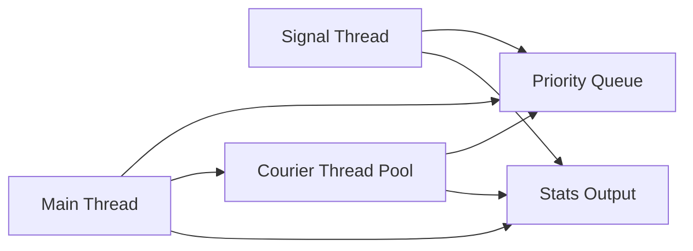

# Priority-Based Cargo Delivery Simulation

## Title Page

- Student ID: `220104004043`
- Course: CSE344 System Programming
- Assignment: HW5
- Project: Priority-Based Cargo Delivery Simulation
- Date: 2026-05-07

## System Design

This implementation uses a single main thread, a fixed pool of courier threads, and one dedicated signal thread for `SIGINT` handling.

### Key components
- `main.c`: program initialization, argument parsing, queue population, thread lifecycle management, final summary output.
- `order.c` / `order.h`: input parsing and validation.
- `priority_queue.c` / `priority_queue.h`: sorted queue implementation by priority and order ID.
- `courier.c` / `courier.h`: courier thread behavior, delivery simulation, protected logging.
- `stats.c` / `stats.h`: atomic statistics aggregation and output generation.

## Priority Queue Design

The queue uses a dynamic array of `Order` structs kept sorted during insertion by:
1. priority: `EXPRESS`, `STANDARD`, `ECONOMY`
2. order ID ascending

This guarantees that the next dequeued order is always the highest-priority available order. Since all orders are queued before couriers begin, this design is simple and correct.

## Synchronization Strategy

- `queue_mutex`: protects access to the shared priority queue.
- `queue_cond`: wakes waiting couriers when orders are available or when shutdown begins.
- `log_mutex`: ensures each log line is printed atomically with a single `printf` call.
- `_Atomic` counters in `stats.c` track completed orders, cancelled orders, and total delivery time without additional mutexes.

## SIGINT Handling

A dedicated signal thread uses `sigtimedwait()` to catch `SIGINT` safely.

- `SIGINT` is blocked in the main thread and all courier threads.
- The signal thread waits for `SIGINT` and then:
  - sets shutdown mode
  - counts pending orders
  - logs `SIGINT_RECEIVED`
  - cancels queued orders
  - broadcasts the queue condition variable

Active deliveries are not interrupted; couriers finish current jobs and then exit cleanly.

## Test Scenarios

1. `./cargoGTU -n 3 -i 10orders_mix.txt -s stats.txt`
2. `./cargoGTU -n 10 -i 10orders_economy.txt -s stats.txt`
3. `./cargoGTU -n 2 -i 20orders_mix.txt -s stats.txt` then send `SIGINT` after about 2 seconds.
4. `valgrind --leak-check=full ./cargoGTU -n 3 -i 10orders_mix.txt -s stats.txt`
5. `./cargoGTU -n 10 -i 20orders_mix.txt -s stats.txt` repeated runs.

## Challenges & Solutions

- `SIGINT` handling in a multithreaded program: solved with a dedicated `sigtimedwait()` signal thread.
- Parser robustness: invalid lines are skipped silently and newline characters are handled cleanly.
- Atomic statistics: statistics are updated without mutexes using `<stdatomic.h>`.

## Architecture Diagram

